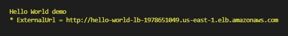

# Hello World demo
A demo Hello World application to demonstrate an ECS service deployed in Cloudformation.

## Deployment

### Prerequisites

* [Node.js version 12.0.0 or later](https://nodejs.org/) to run Node scripts
* [AWS account](https://aws.amazon.com/) to create resources
* [AWS CLI version 2](https://docs.aws.amazon.com/cli/latest/userguide/install-cliv2.html) to run scripts
* [Git Bash](https://git-scm.com/) to run Bash scripts (only on Windows)
* [Docker version 20.10.5 or later](https://www.docker.com/) and Docker daemon up and running to build and push ECS container images

### 1) Configure AWS CLI

Run `aws configure` to set your credentials and the region where you want the demo resources deployed.

### 2) Run deployment script

Go to the **deployment** folder and run:

`bash deploy.sh`.

This will deploy the demo infrastructure in AWS.

## Usage

At the end of the deploy.sh execution, you will see in the output in the console the **ExternalURL** to get access to the services.

## Re-Deployment without outage

Run `bash redeploy.sh`.

This will redeploy a service without outage, asking for two variables:
- ClusterName
- ServiceName

This script is usefull when you need to update your ECS container service without outage